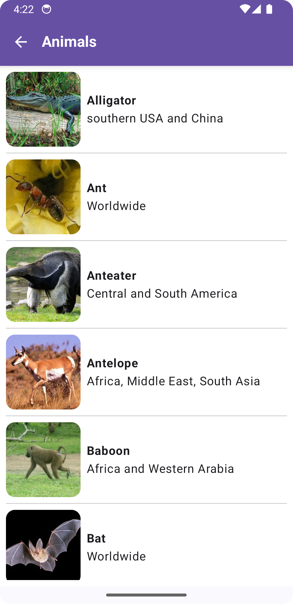
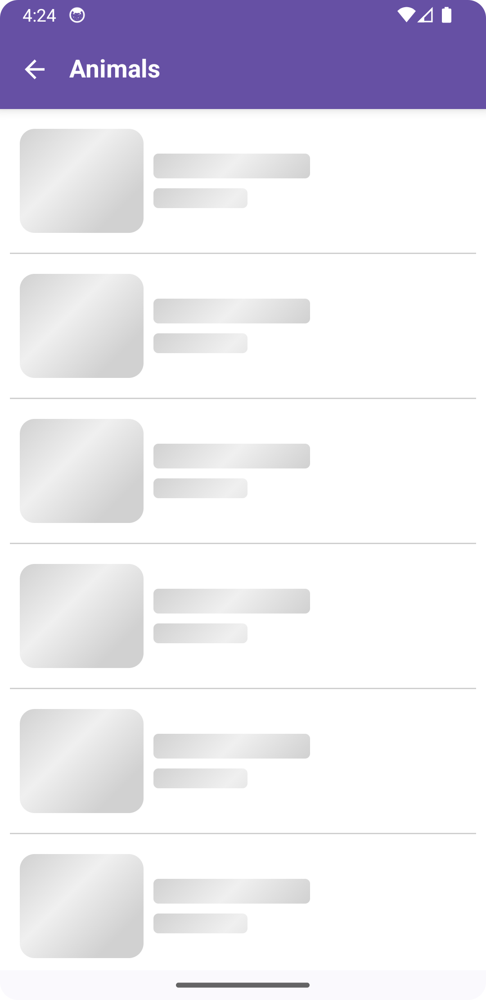
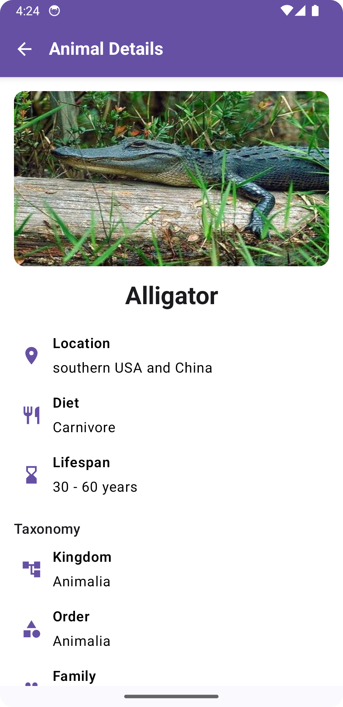
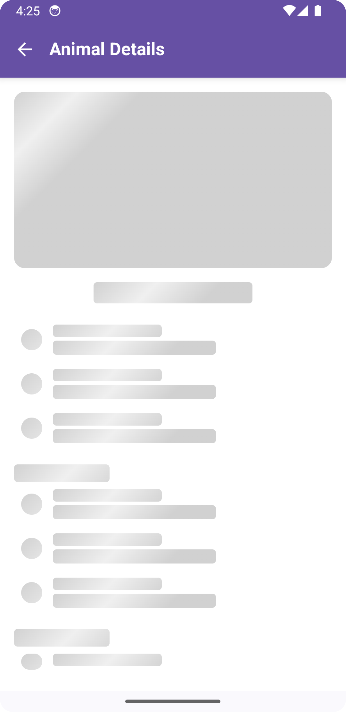

# 🐾 Kotlin Compose MVI Animals App

[](https://kotlinlang.org/)
[](https://developer.android.com/jetpack/compose)
[](https://en.wikipedia.org/wiki/Model–view–intent)
[](https://dagger.dev/hilt)

A hands-on Android project demonstrating **MVI (Model–View–Intent)**, **Clean Architecture**, and **SOLID** principles using **Jetpack Compose** and **Dagger Hilt** for dependency injection.

> **Note:** Unit & integration testing support will be added soon.

---

## 🗂 Table of Contents
1. [Motivation](#motivation)
2. [Features](#features)
3. [Tech Stack & Key Dependencies](#tech-stack--key-dependencies)
4. [Project Structure](#project-structure)
5. [Getting Started](#getting-started)
6. [Road-map](#road-map)
7. [Contributing](#contributing)

---

## ✨ Motivation

This project aims to:

- Explore **MVI** with Jetpack Compose.
- Apply **Clean Architecture** layering.
- Practice **SOLID** design principles.
- Use **Dagger Hilt** for dependency injection.

---

## 🐘 Features

| UI | Domain | Data |
| --- | --- | --- |
| • Compose screens with state-hoisting<br>• Material 3 theming<br>• Skeleton versions for all Composable components | • Use cases orchestrating business logic | • REST consumption via Retrofit<br>• Future local cache (Room) |
| • Loading / error placeholders | • Immutable result modeling | • Repository & data abstraction |
| • Animal detail taxonomy view | • Separation of concerns | • Dispatcher configuration |

---

## 🔧 Tech Stack & Key Dependencies

| Category | Library |
|----------|---------|
| **Language** | Kotlin 2.0.0, Coroutines |
| **UI** | Jetpack Compose, Material3 |
| **Architecture** | ViewModel, StateFlow, MVI |
| **DI** | Dagger Hilt |
| **Networking** | Retrofit, OkHttp, Moshi |
| **Testing (coming soon)** | JUnit5, Turbine, MockK |
| **Build** | Gradle KTS, GitHub Actions (CI planned) |

---

## 📁 Project Structure

<pre>
📦 kotlin-compose-mvi-animals-app
 ┣ 📂 core                 ← Common utilities, models, result wrappers, extensions
 ┣ 📂 data                 ← DTOs, services, repository implementation, mappers
 ┣ 📂 di                   ← Hilt modules for DI
 ┣ 📂 domain              ← Business logic: use cases and interfaces
 ┣ 📂 presentation        ← Compose UI, MVI ViewModels and state
 ┃ ┣ 📂 components         ← Shared UI components
 ┃ ┣ 📂 features           ← Modular screens
 ┃ ┃ ┣ 📂 animal_details
 ┃ ┃ ┗ 📂 animal_list
 ┃ ┗ 📂 navigation         ← App navigation logic
 ┣ 📂 ui.theme            ← Theme and color definitions
 ┣ 🧩 AnimalApplication.kt ← App entry point with Hilt config
 ┗ 🧩 MainActivity.kt      ← Activity hosting Compose content
</pre>

---

## 🚀 Getting Started

```bash
git clone https://github.com/felippeneves/kotlin-compose-mvi-animals-app.git
cd kotlin-compose-mvi-animals-app
```

Open in Android Studio (Iguana or newer) and run the `app` module on an emulator or physical device.

---

## 📸 Screenshots

### 🦁 Animal List Screens

| List Screen | Loading Screen |
|-------------|----------------|
|  |  |

### 🦁 Animal Details Screen

| List Screen | Loading Screen |
|-------------|----------------|
|  |  |

---

## 🛣 Road-map

- [X] ✅ Animal listing and detail view
- [ ] 🧪 Add unit tests for use cases and viewmodels
- [ ] 🧪 Add integration tests with UI testing
- [ ] 🔁 Add Room for local cache
- [ ] 🏗️ Setup GitHub Actions CI/CD pipeline

---

## 🤝 Contributing

Feel free to fork, suggest improvements or open a PR! All contributions are welcome 🚀
